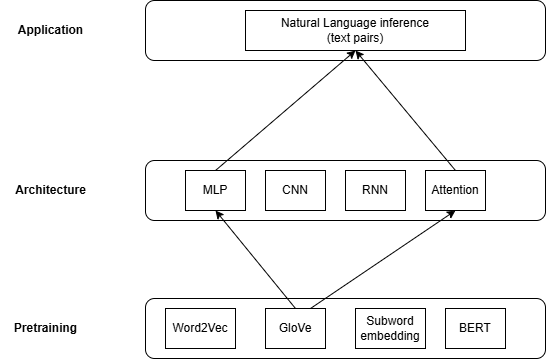
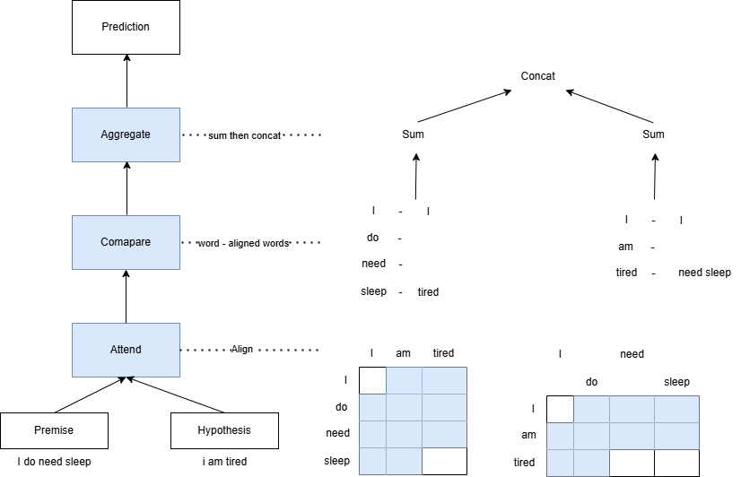
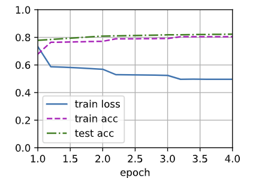
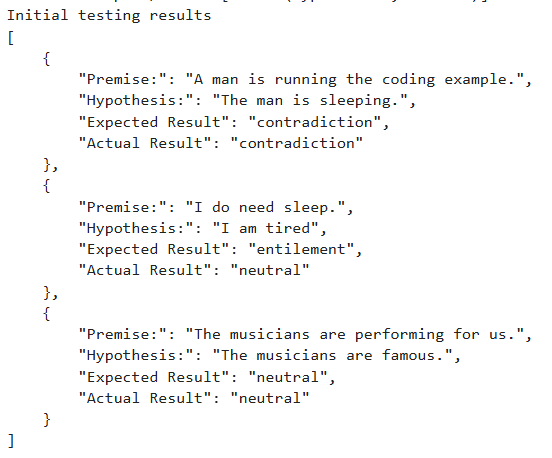
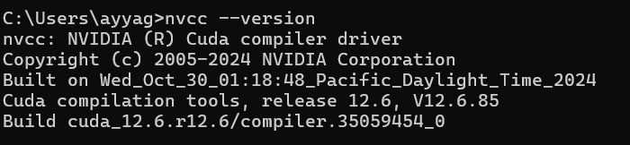
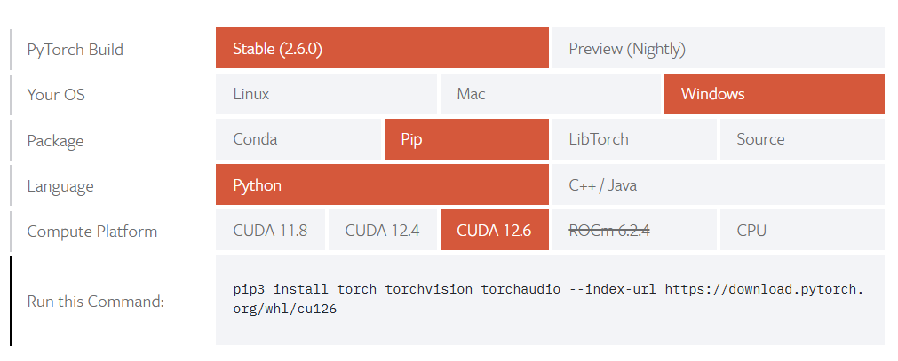
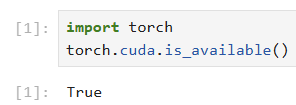

### Natural Language Inference using attention (with multi layer perceptrons, MLPs)

**Rama Viswanatha G Ayyagari**

#### Executive summary
Natural Language Inference determines the logical relationship between a pair of text sequences, say `hypoheses` and `premises`. In other words it studies whether a `hypoheses` can be inferred from a `premises`.Such relationships fall into these types:

##### Entailment: the hypothesis can be inferred from the premise.
    Premise: Two women hugging each other.
    Hypothesis: Two women are showing affection.
##### Contradiction: the negation of hypothesis can be inferred from premise.
    Premise: A man is running code example
    Hypothesis: The man is sleeping
##### Neutral: all other cases
    Premise: The musicians are performing for us.
    Hypothesis: The musicians are famous.

#### Rationale
This is central topic for understanding natural language.it has wide applications ranging from information retrieval to open-domain question answering.

#### Research Question
When presented with two text sequences, `premises` and `hypotheses`, the expected result, either one of Entailment, Contradiction or neutral based on logical semantic relation between the `premises` and `hypotheses`.

#### Data Sources
The Stanford Natural Language Inference (SNLI) Dataset has 500000 labeled English sentences pairs. URL: 'https://nlp.stanford.edu/projects/snli/snli_1.0.zip'

#### Methodology
In the view of many models that are based on complex and deep architecures, will use natural language inference with attention methodology (with multi layer perceptrons, MLPs) know as `decomposable attention model`, for this. The solution will feeds  pre-trained `GloVe` to the architecture based on attention and MLPs for natural language inference.

##### Model

We align tokens in one text sequence to every token on the other, and vice-versa, then compare and aggregate such information to predict the logical relationship between text sequences, `premises` and `hypotheses`.

At a highlevel, it consists of three jointly trained steps: attending, comparing, and aggregating.

##### Attending

First step is to align tokens in one text sequence to each other in the other text sequence. Suppose the premise is `i do need slpeep` and the hypothesis is `i am tired`.Due to semantic similarlity, we may wish to align `i` in the hypothesis with `i` in premise, and align `tired` in the hypohesis with `sleep` in the premise. Likewise we may wish to align `i` in the premise with `i` in the hypohesis and align `need ` and `sleep` in the premise with the `tired` in the hypohesis. This is `soft` alignment using weighted average, where ideally large weights are associated with the tokens to be aligned, as outlined below. This is 'hard` way.

Let A = (a1, ....., am) and B = (b1, ...., bn) the premsie and hyphothesis, where number of tokens are m and n respectively, where ai, bj ∈ Rd (i = 1, ..., m, j = 1, ..., n) is a `d`-dimentional word vector. for `soft` alignment, we compute the attention weights eij ∈ R as eij = f((ai)T) f(bj) where the function f is an MLP (multilayer perceptron).𝑓 takes inputs a𝑖 and b𝑗 separately rather than takes a pair of them together as input.This `decomposition` trick leads to only 𝑚+𝑛 applications (linear complexity) of 𝑓 rather than 𝑚𝑛 applications (quadratic complexity).

To mormalize the attention weights, we compare the weighted average of all the token vectors in the hypohesis to obtain representation of the hypothesis that is softly aligned with the token indexed by `i` in the premise:
    
$$ 𝜷_i = \sum_{j=1}^n  ( exp(e_ij) / \sum_{k=1}^n exp(e_ik) ) b_j $$

Likewise, we compute soft alignment of premise tokens for each token indexed by 𝑗 in the hypothesis

$$ 𝜶_j = \sum_{i=1}^m  ( exp(e_ij) / \sum_{k=1}^m exp(e_kj) ) a_i $$

##### Comparing

In the next step, we compare a token in one sequence with the other sequence that is softly aligned with that token. Note that in soft alignment, all the tokens from one sequence, though with probably different attention weights, will be compared with a token in the other sequence.For example, suppose that the attending step determines that `need` and `sleep` in the premise are both aligned with `tired` in the hypothesis, the pair `tired–need sleep` will be compared.

In the comparing step, we feed the concatenation (operator [.,.]) of tokens from one sequence and aligned tokens from the other sequence into a function 𝑔 (an MLP):

$$ V_A,i = g([a_i,𝜷_i]), i = 1, ......, m $$
$$ V_B,j = g([b_j,𝜶_j]), j = 1, ......, n $$

v𝐴,𝑖 is the comparison between token 𝑖 in the premise and all the hypothesis tokens that are softly aligned with token 𝑖; while v𝐵, 𝑗 is the comparison between token 𝑗 in the hypothesis and all the premise tokens that are softly aligned with token 𝑗.

##### Aggregating

With two sets of comparison vectors v𝐴,𝑖 (𝑖 = 1, . . . , 𝑚) and v𝐵, 𝑗 ( 𝑗 = 1, . . . , 𝑛) on hand, in the last step we will aggregate such information to infer the logical relationship. We begin by summing up both sets:

$$ V_A = \sum_{i=1}^m V_A,i $$

$$ V_B = \sum_{j=1}^n V_B,j $$

Next we feed the concatenation of both summarization results into function ℎ (an MLP) to obtain the classification result of the logical relationship:

$$ \hat{y} = h([V_A,V_B]) $$

#### Results
##### Model Performance

##### Initial testing results

#### Next steps
1. Change the embedding, i.e from GloVe to other types of embedings like Word2Vec, Subword or BERT with the same Architecture to evaluvate performance.
2. Error anlysis

#### Outline of project

- [Natural Language Inference with attention and MLP](nli%20with%20attention%20and%20MLP.ipynb)
- [Utlity functions library](nli.ipynb)

##### Contact and Further Information
    Rama Viswanatha G Ayyagari
    gouri.ayyagari@gmail.com

### Installation
#### Note: GPU is needed to run this project. Also Nvidia cuda needs to installed.Tested on windows 11 laptop with Nvidia GEFORCE RTX GPU.

#### Install Nvidia cuda.`https://docs.nvidia.com/cuda/cuda-installation-guide-microsoft-windows/`

#### Identify nvidia cuda version.`nvcc --version`

#### Prepare pip command to install pytorch compatible with installed cuda version.

#### Navigate to `https://pytorch.org/get-started/locally/`. In `START LOCALLY` select cuda version, OS, package type etc to get command to install.

#### Install Anaconda

#### Create conda virtual environment. `conda create --name cuda_venv`
#### Activate virtual envionment `conda activate cuda_venv`
#### Install dependencies using previously generated command. i.e `pip3 install torch torchvision torchaudio --index-url https://download.pytorch.org/whl/cu126`
#### Run jupyter notebook. `jupyter notebook`
#### Test cuda availablity
 
